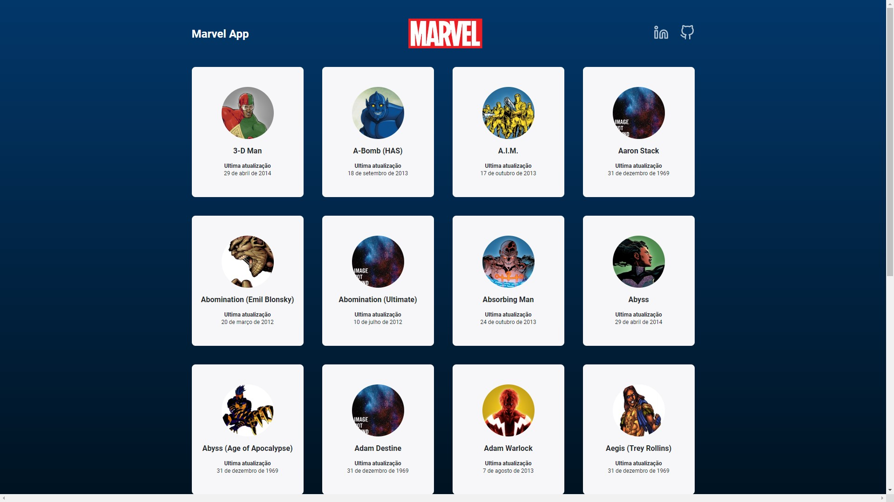

## Marvel App

Aplicação feita em ReactJS que consome a API da Marvel

[[Confira aqui:]](https://marvel-app-api.netlify.app/)

<br>
<br>
<br>

### Configuração

#### Crie uma conta na Marvel Develope Portal

- Acesse https://developer.marvel.com e crie sua conta.
- **Ative sua conta** atráves do link enviado por email

#### Crie um arquivo .env

- Crie um arquivo .env **na raiz do projeto** e informe suas API Keys (https://developer.marvel.com/account)

> .env

```
REACT_APP_MARVEL_API_BASE= https://gateway.marvel.com/v1/public/characters
REACT_APP_MARVEL_PUBLIC_KEY = PUBLIC_KEY
REACT_APP_MARVEL_PRIVATE_KEY= PRIVATE_KEY
```

### Iniciando

#### Instale as dependências

> yarn install

#### Inicie o servidor local

> yarn start

